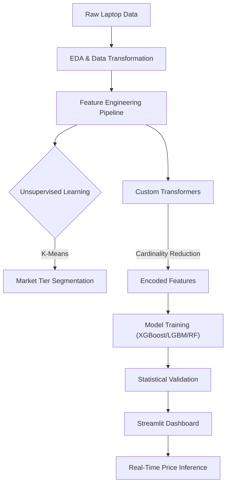

# 💻 Laptop Price Intelligence & Market Dashboard

[](https://nitolaptoppricepredictor.streamlit.app/)
[](https://opensource.org/licenses/MIT)
[](https://www.python.org/)

## 📖 Overview

**Laptop Price Intelligence** is an end-to-end Machine Learning solution that transforms raw technical specifications into actionable market insights and precise price valuations.

Designed to simulate a **real-world pricing engine**, this project moves beyond simple regression by incorporating **unsupervised market segmentation (K-Means)** and **automated Scikit-Learn pipelines** to handle complex, high-cardinality data.

**Primary Goals:**
* **Analyze** the impact of hardware specs (RAM, GPU, CPU) on market pricing.
* **Segment** the market into latent tiers using clustering algorithms.
* **Benchmark** advanced regression architectures (XGBoost, LightGBM, Random Forest).
* **Deploy** a production-ready inference engine via Streamlit.

---

## 🏗️ Architecture

### System Flow



### Component Breakdown

| Component | Purpose |
| --- | --- |
| **Data Ingestion** | Loads raw specs, handles missing values, and parses complex strings (e.g., "Intel Core i7 2.7GHz"). |
| **Preprocessing Pipeline** | A unified Scikit-Learn pipeline that handles Scaling, One-Hot Encoding, and Custom Transformations. |
| **Clustering Engine** | Uses **K-Means** to group laptops into "Budget," "Mid-Range," and "Flagship" tiers based on performance. |
| **Modeling Engine** | Trains and cross-validates XGBoost, LightGBM, and Random Forest regressors. |
| **Evaluation Layer** | Validates assumptions using **Shapiro-Wilk** (Normality) and **Breusch-Pagan** (Homoscedasticity) tests. |
| **Dashboard Layer** | An interactive UI for market analysis and single-instance price prediction. |

---

## 📊 Dataset Description

The dataset comprises technical specifications and market prices for over 1,300 distinct laptop configurations.

**Target Variable:** `Price` (EUR/USD)

**Key Features:**

* **Processing:** CPU Brand, CPU Frequency, Number of Cores.
* **Memory:** RAM (GB), Storage Type (SSD/HDD/Flash), Storage Capacity.
* **Visuals:** GPU Brand, Screen Resolution, IPS Panel, Touchscreen.
* **Physical:** Weight (kg), Form Factor (Ultrabook, Gaming, Notebook).

| Column | Non-Null Count | Dtype | Description |
| --- | --- | --- | --- |
| `Company` | 1303 | object | Manufacturer (Dell, Apple, Lenovo, etc.) |
| `TypeName` | 1303 | object | Form factor (Ultrabook, Gaming, etc.) |
| `Inches` | 1303 | float64 | Screen size diagonal |
| `ScreenResolution` | 1303 | object | Raw resolution string (parsed in pipeline) |
| `Cpu` | 1303 | object | Processor details |
| `Ram` | 1303 | int32 | Memory in GB |
| `Memory` | 1303 | object | Storage details (e.g., "128GB SSD + 1TB HDD") |
| `Gpu` | 1303 | object | Graphics card details |
| `OpSys` | 1303 | object | Operating System |
| `Weight` | 1303 | float64 | Weight in kg |
| `Price` | 1303 | float64 | **Target Variable** |

---

## 🔍 Exploratory Data Analysis (EDA)

Comprehensive analysis was performed to understand the drivers of laptop pricing.

**Key Findings:**

1. **The RAM "Gold Standard":** Feature importance analysis consistently highlighted **RAM** as the single most influential predictor of price, often outweighing CPU clock speed.
2. **Market Segmentation:** Clustering revealed distinct pricing tiers that standard categorical features (like "Brand") failed to capture.
3. **Non-Linearity:** Price distributions are heavily right-skewed, necessitating log-transformations for linear stability.

*(Note: Replace the link above with your actual screenshot of the Feature Importance plot)*

---

## 🛠️ Feature Engineering & Pipelines

To ensure a robust and leak-free workflow, I implemented custom Scikit-Learn transformers:

* **`CardinalityReducer`:** Automatically groups infrequent categorical levels (e.g., obscure GPU brands) into an "Other" category to prevent overfitting.
* **Feature Extraction:** Parsed complex string columns (Screen Resolution, CPU) into numerical features like `PPI` (Pixels Per Inch) and `CPU_Freq`.
* **Target Encoding:** Applied to high-cardinality features where One-Hot Encoding would create too much sparsity.

---

## 📈 Model Performance

I benchmarked multiple algorithms to find the optimal balance between accuracy and inference speed. **XGBoost** was selected as the champion model.

| Model | R² Score | MAE | Status |
| --- | --- | --- | --- |
| **XGBoost Regressor** | **0.872** | **Low** | 🏆 **Winner** |
| LightGBM | 0.861 | Low | Benchmark |
| Random Forest | 0.808 | Medium | Benchmark |
| Elastic Net| 0.727 | High | Baseline |
| Linear Regression | 0.719 | High | Baseline |

---

## 💻 Streamlit Dashboard

The application is deployed on Streamlit Cloud and features two main modules:

### 1. Market Explorer

Visualizes the dataset, showing price distributions across different brands, types, and hardware configurations.

### 2. AI Price Predictor

A real-time inference interface where users can configure a laptop's specs and receive an instant price valuation with confidence intervals.

*(Note: Replace the link above with a screenshot of your dashboard)*

---

## ⚙️ Technical Challenges & Solutions

* **Serialization in the Cloud:** * *Challenge:* `joblib` failing to load custom transformers on Streamlit Cloud due to namespace issues.
* *Solution:* Implemented `sys.path` injection and manual `__main__` module mapping to ensure robust unpickling.


* **Dependency Conflicts:**
* *Challenge:* Python 3.13 compatibility with older `xgboost` and `lightgbm` wheels.
* *Solution:* Curated a specific `requirements.txt` with pinned versions for stable cloud deployment.


---

## 🤝 Mentorship & Acknowledgments

This project was developed as part of the **PathLine Training Academy** Data Science program.

A massive shoutout to **Adel Sobhy** for his mentorship, technical guidance, and for fostering a production-first mindset throughout the development lifecycle.

---

## 🔗 Links & Usage

* **Live App:** [Streamlit Dashboard](https://www.google.com/url?sa=E&source=gmail&q=https://nitolaptoppricepredictor.streamlit.app/)
* **Kaggle Notebook:** [View Analysis on Kaggle](https://www.google.com/search?q=YOUR_KAGGLE_LINK_HERE)

### Local Installation

```bash
# 1. Clone the repository
git clone [https://github.com/NitoBoritto/ML_Laptop_Price_Predictor.git](https://github.com/NitoBoritto/ML_Laptop_Price_Predictor.git)

# 2. Install dependencies
pip install -r requirements.txt

# 3. Run the dashboard
streamlit run 🏠_Home.py

```
